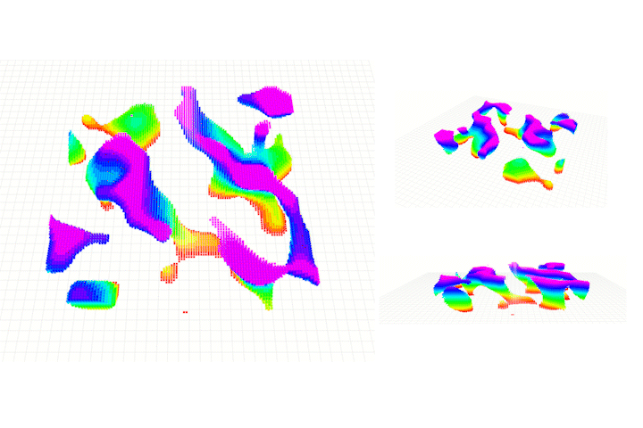
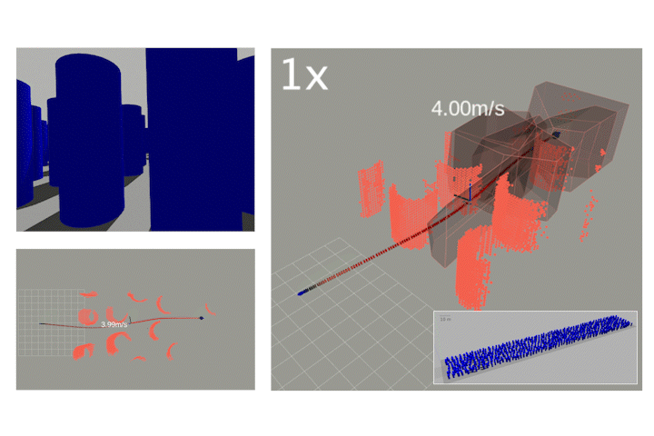
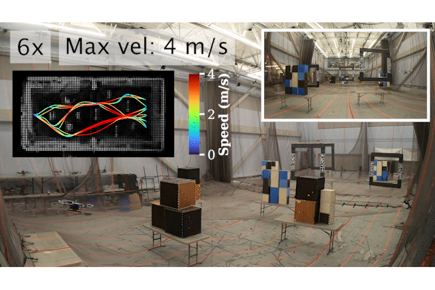
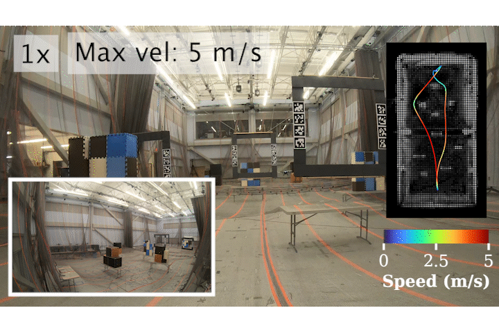
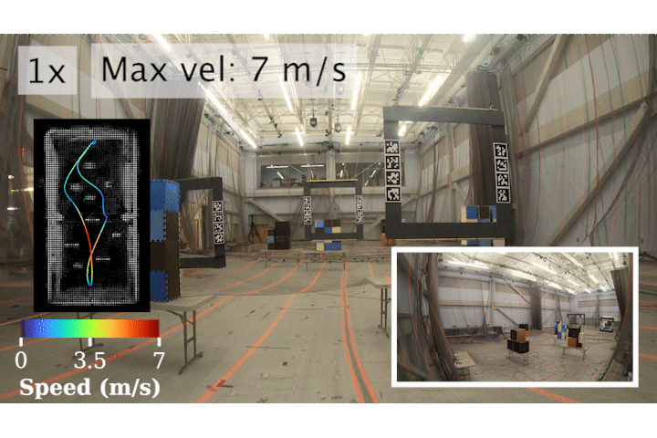
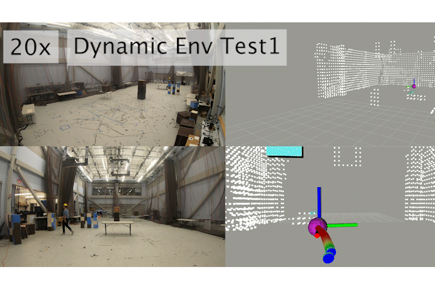
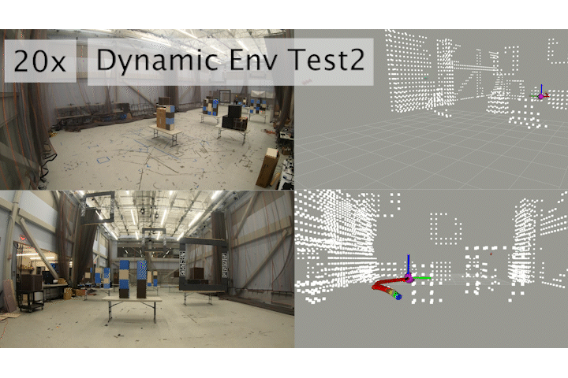

# DYNUS: Hermite Spline-based Efficient Trajectory Planning #

If you like this project, please consider starring ⭐ the repo!

### **Submitted to the IEEE Robotics and Automation Letters (RA-L)**

| **Trajectory** | **Forest** |
| ------------------------- | ------------------------- |
<a target="_blank" href="https://youtu.be/Pvb-VPUdLvg"></a> | <a target="_blank" href="https://youtu.be/Pvb-VPUdLvg"></a> |

| **Dynamic Obstacles** | **Long Flight** |
| ------------------------- | ------------------------- |
<a target="_blank" href="https://youtu.be/Pvb-VPUdLvg"></a> | <a target="_blank" href="https://youtu.be/Pvb-VPUdLvg"></a>

| **Fast Flight 1** | **Fast Flight 2** |
| ------------------------- | ------------------------- |
<a target="_blank" href="https://youtu.be/Pvb-VPUdLvg"></a> | <a target="_blank" href="https://youtu.be/Pvb-VPUdLvg"></a>

| **Dynamic Env 1** | **Dynamic Env 2** |
| ------------------------- | ------------------------- |
<a target="_blank" href="https://youtu.be/Pvb-VPUdLvg"></a> | <a target="_blank" href="https://youtu.be/Pvb-VPUdLvg"></a>

## Paper

DYNUS: Hermite Spline-based Efficient Trajectory Planning is available [https://arxiv.org/abs/2511.10822](https://arxiv.org/abs/2511.10822)!

```bibtex
@article{kondo2025mighty,
      title={DYNUS: Hermite Spline-based Efficient Trajectory Planning}, 
      author={Kota Kondo and Yuwei Wu and Vijay Kumar and Jonathan P. How},
      year={2025},
      eprint={2511.10822},
      archivePrefix={arXiv},
      primaryClass={cs.RO},
      url={https://arxiv.org/abs/2511.10822}, 
}
```

## Video

The full video is available [https://youtu.be/Pvb-VPUdLvg](https://youtu.be/Pvb-VPUdLvg).

## Interactive Demo

If you are interested in an interactive demo of DYNUS, please switch to the `interactive_demo` branch [https://github.com/mit-acl/dynus/tree/interactive_demo] by running:

```bash
git checkout interactive_demo
```
and follow the setup instructions in the README of that branch.

## Fork

Since you might want to use interactive demos, when you fork this repository, please make sure to also include the `interactive_demo` branch by unselecting the "Copy the main branch only" option.

## Setup

DYNUS has been tested on both Docker and native installations on Ubuntu 22.04 with ROS 2 Humble.

### Use Docker (Recommended)

1. **Install Docker:**  
   Follow the [official Docker installation guide for Ubuntu](https://docs.docker.com/engine/install/ubuntu/).

2. **Clone the Repository and Navigate to the Docker Folder:**
   ```bash
   mkdir -p ~/code/ws/src
   cd ~/code/ws/src
   git clone https://github.com/mit-acl/dynus.git
   cd src/dynus/docker
   ```

3. **BUILD:**
    - Navigate to the docker folder in your dynus repo (eg. `cd ~/code/ws/src/dynus/docker/`) and run this
      ```bash
      make build
      ```

4. **Run Simulation**
    - Run the following command to start the simulation:
      ```bash
      make run
      ```

<details>
  <summary><b>Useful Docker Commands</b></summary>

  - **Remove all caches:**  
    ```bash
    docker builder prune
    ```

  - **Remove all containers:**  
    ```bash
    docker rm $(docker ps -a -q)
    ```

  - **Remove all images:**  
    ```bash
    docker rmi $(docker images -q)
    ```

</details>

### Native Installation

1. **Clone the Repository and Navigate to the Workspace Folder:**
   ```bash
   mkdir -p ~/code/ws
   cd ~/code/ws
   git clone https://github.com/mit-acl/dynus.git
   cd dynus
   ```

2. **Run the Setup Script:**
   ```bash
   ./setup.sh
   ```
   This script will first install ROS 2 Humble, then DYNUS and its dependencies. Please note that this script modifies your `~/.bashrc` file.

 3. **Run the Simulation**
    Run the simulation. You might need to change the path to `setup.bash` to its absolute path (eg. `/home/kkondo/code/ws/install/setup.bash`).
    ```bash
    cd ~/code/dynus_ws && ./src/dynus/launch/run_dynus_sim.sh ~/code/dynus_ws/install/setup.bash
    ```

## Benchmarking

This section describes the complete workflow for running local trajectory optimization benchmarks.

### Overview

The benchmarking pipeline consists of three main steps:
1. **Generate Safety Corridors**: Create standardized test cases with safe flight corridors
2. **Run Benchmarks**: Execute trajectory optimization benchmarks (standardized and variable elimination)
3. **Generate LaTeX Tables**: Process results and generate publication-ready tables

### Step 1: Generate Safety Corridors

Safety corridors define the collision-free space for trajectory optimization. Generate them once and reuse for all benchmarks.

```bash
# Build the workspace
cd ~/code/dynus_ws
colcon build --cmake-args -DCMAKE_BUILD_TYPE=Release --packages-select dynus

# Source the workspace
source install/setup.bash

# Generate safety corridors
tmuxp load src/dynus/launch/generate_sfc.yaml
```

**Output**: Safety corridor files (`.mysco2` format) saved to `src/dynus/data/`

**What it does**:
- Launches simulator in background
- Generates random start/goal pairs in standardized environment
- Computes safe flight corridors using convex decomposition
- Saves corridors as binary files for reproducible benchmarks

### Step 2: Run Standardized Benchmarks

Run comprehensive benchmarks comparing DYNUS (single/multi-threaded) and FASTER (original).

```bash
cd ~/code/dynus_ws/src/dynus/benchmarking

# Run the full benchmark suite
python3 run_benchmark_suite.py
```

**Output**: CSV files in `benchmark_data/`:
- `single_thread/dynus_N_benchmark.csv` (N=4,5,6)
- `single_thread/original_faster_N_benchmark.csv` (N=4,5,6)
- `multi_thread/dynus_N_benchmark.csv` (N=4,5,6)

**What it does**:
- Tests multiple problem sizes (N=4,5,6 segments)
- Compares single-threaded vs multi-threaded optimization
- Measures computation time, success rate, trajectory quality, and constraint violations
- Runs 100+ test cases per configuration

**Options**:
```bash
# Factor determination mode (for tuning factor ranges)
python3 run_benchmark_suite.py --factor-determination
```

### Step 3: Run Variable Elimination Benchmarks

Compare DYNUS with and without variable elimination to demonstrate its performance impact.

```bash
cd ~/code/dynus_ws/src/dynus/benchmarking

# Run VE comparison benchmark
python3 run_benchmark_suite.py --ve-comparison
```

**Output**: CSV files in `benchmark_data/ve_benchmark/`:
- `dynus_N_with_ve_benchmark.csv` (N=4,5,6)
- `dynus_N_without_ve_benchmark.csv` (N=4,5,6)

**What it does**:
- Runs multi-threaded DYNUS with variable elimination enabled
- Runs multi-threaded DYNUS with variable elimination disabled
- Directly compares optimization speed for the same problem instances
- Highlights the computational benefit of variable elimination

### Step 4: Generate LaTeX Tables

Process benchmark results and generate publication-ready LaTeX tables.

```bash
cd ~/code/dynus_ws/src/dynus/benchmarking

# Generate both standardized and VE benchmark tables
python3 generate_latex_table.py
```

**Output**: LaTeX files in `/home/kkondo/paper_writing/DYNUS_v3/tables/`:
- `standardized_benchmark.tex` - Full comparison table
- `ve_benchmark.tex` - Variable elimination comparison table

**What it does**:
- Loads CSV benchmark data
- Computes statistics (mean, success rate, violations)
- Generates formatted LaTeX tables with best/worst highlighting
- Ready for direct inclusion in paper with `\input{}`

### Step 5: Analyze Results (Optional)

Use Jupyter notebook for detailed analysis and visualization.

```bash
cd ~/code/dynus_ws/src/dynus/benchmarking

# Open Jupyter notebook
jupyter notebook local_traj_benchmark.ipynb
```

**Features**:
- Load and analyze benchmark CSV data
- Generate summary statistics tables
- Create plots comparing different configurations
- Export results for paper figures

**How to use the notebook**:

1. **Run the first cell** to load standardized benchmark data:
   ```python
   # The notebook automatically loads from:
   # - single_thread/dynus_N_benchmark.csv
   # - single_thread/original_faster_N_benchmark.csv
   # - multi_thread/dynus_N_benchmark.csv
   ```
   This generates a unified summary table with statistics.

2. **Run the VE benchmarking cell** (second cell) to load variable elimination data:
   ```python
   # Loads from ve_benchmark/ folder:
   # - dynus_N_with_ve_benchmark.csv
   # - dynus_N_without_ve_benchmark.csv
   ```
   This generates a comparison table showing VE impact.

3. **Run visualization cells** to create plots (optional):
   - Computation time vs N
   - Success rates
   - Trajectory quality metrics

**Note**: The notebook expects the benchmark data to exist. Run Steps 2-3 first to generate the CSV files.

### Step 6: Visualize Trajectories in RViz (Optional)

Visualize and compare trajectories from different planners side-by-side in RViz.

```bash
cd ~/code/dynus_ws

# Build if needed
colcon build --cmake-args -DCMAKE_BUILD_TYPE=Release --packages-select dynus

# Source the workspace
source install/setup.bash

# Launch visualization
tmuxp load src/dynus/launch/visualize_local_trajs.yaml
```

**What it does**:
- Reads saved trajectory files from `traj_dump/` directories
- Loads the same test case for multiple planners
- Displays trajectories with color-coded velocity profiles
- Shows safe flight corridors and obstacle environment
- Allows step-by-step comparison

**Configuration**:
- Edit `visualize_local_trajs.yaml` to specify which trajectories to load
- Set `traj_dump_root_dirs_` to point to trajectory dump directories
- Trajectories are automatically generated during benchmarks if `traj_dump_enable: true`

**Controls in RViz**:
- Use markers to select different test cases
- Toggle trajectory visibility per planner
- Inspect velocity, acceleration, and jerk profiles
- Verify corridor constraints visually

### Directory Structure

```
dynus/
├── benchmarking/
│   ├── run_benchmark_suite.py          # Main benchmark runner
│   ├── generate_latex_table.py         # Table generator
│   ├── local_traj_benchmark.ipynb      # Analysis notebook
│   └── ...
├── benchmark_data/
│   ├── single_thread/                  # Single-threaded results
│   ├── multi_thread/                   # Multi-threaded results
│   └── ve_benchmark/                   # Variable elimination results
└── data/                               # Safety corridor files (.mysco2)
```

### Tips

- **Build once**: Only rebuild when you modify C++ code
- **Reuse corridors**: Generate safety corridors once, reuse for all benchmarks
- **Run overnight**: Full benchmark suite takes several hours
- **Check results**: Use notebook to verify data quality before generating tables
- **VE comparison**: Run after standardized benchmarks to demonstrate algorithmic contribution
