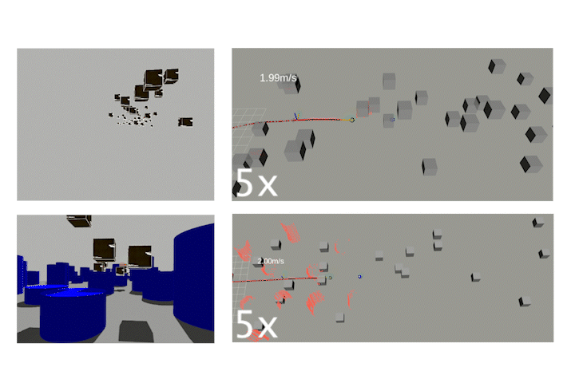

# MIGHTY: Hermite Spline-based Efficient Trajectory Planning #

If you like this project, please consider starring ⭐ the repo!

### **Submitted to the IEEE Robotics and Automation Letters (RA-L)**

| **Trajectory** | **Forest** |
| ------------------------- | ------------------------- |
<a target="_blank" href="https://youtu.be/Pvb-VPUdLvg"></a> | <a target="_blank" href="https://youtu.be/Pvb-VPUdLvg"></a> |

| **Dynamic Obstacles** | **Long Flight** |
| ------------------------- | ------------------------- |
<a target="_blank" href="https://youtu.be/Pvb-VPUdLvg"></a> | <a target="_blank" href="https://youtu.be/Pvb-VPUdLvg"></a>

| **Fast Flight 1** | **Fast Flight 2** |
| ------------------------- | ------------------------- |
<a target="_blank" href="https://youtu.be/Pvb-VPUdLvg"></a> | <a target="_blank" href="https://youtu.be/Pvb-VPUdLvg"></a>

| **Dynamic Env 1** | **Dynamic Env 2** |
| ------------------------- | ------------------------- |
<a target="_blank" href="https://youtu.be/Pvb-VPUdLvg"></a> | <a target="_blank" href="https://youtu.be/Pvb-VPUdLvg"></a>

## Paper

MIGHTY: Hermite Spline-based Efficient Trajectory Planning is available [https://arxiv.org/abs/2511.10822](https://arxiv.org/abs/2511.10822)!

```bibtex
@article{kondo2025mighty,
      title={MIGHTY: Hermite Spline-based Efficient Trajectory Planning}, 
      author={Kota Kondo and Yuwei Wu and Vijay Kumar and Jonathan P. How},
      year={2025},
      eprint={2511.10822},
      archivePrefix={arXiv},
      primaryClass={cs.RO},
      url={https://arxiv.org/abs/2511.10822}, 
}
```

## Video

The full video is available [https://youtu.be/Pvb-VPUdLvg](https://youtu.be/Pvb-VPUdLvg).

## Interactive Demo

If you are interested in an interactive demo of MIGHTY, please switch to the `interactive_demo` branch [https://github.com/mit-acl/mighty/tree/interactive_demo] by running:

```bash
git checkout interactive_demo
```
and follow the setup instructions in the README of that branch.

## Fork

Since you might want to use interactive demos, when you fork this repository, please make sure to also include the `interactive_demo` branch by unselecting the "Copy the main branch only" option.

## Setup

MIGHTY has been tested on both Docker and native installations on Ubuntu 22.04 with ROS 2 Humble.

### Use Docker (Recommended)

1. **Install Docker:**  
   Follow the [official Docker installation guide for Ubuntu](https://docs.docker.com/engine/install/ubuntu/).

2. **Clone the Repository and Navigate to the Docker Folder:**
   ```bash
   mkdir -p ~/code/ws/src
   cd ~/code/ws/src
   git clone https://github.com/mit-acl/mighty.git
   cd src/mighty/docker
   ```

3. **BUILD:**
    - Navigate to the docker folder in your mighty repo (eg. `cd ~/code/ws/src/mighty/docker/`) and run this
      ```bash
      make build
      ```

4. **Run Simulation**
    - Run the following command to start the simulation:
      ```bash
      make run
      ```

<details>
  <summary><b>Useful Docker Commands</b></summary>

  - **Remove all caches:**  
    ```bash
    docker builder prune
    ```

  - **Remove all containers:**  
    ```bash
    docker rm $(docker ps -a -q)
    ```

  - **Remove all images:**  
    ```bash
    docker rmi $(docker images -q)
    ```

</details>

### Native Installation

1. **Clone the Repository and Navigate to the Workspace Folder:**
   ```bash
   mkdir -p ~/code/ws
   cd ~/code/ws
   git clone https://github.com/mit-acl/mighty.git
   cd mighty
   ```

2. **Run the Setup Script:**
   ```bash
   ./setup.sh
   ```
   This script will first install ROS 2 Humble, then MIGHTY and its dependencies. Please note that this script modifies your `~/.bashrc` file.

 3. **Run the Simulation**
    Run the simulation. You might need to change the path to `setup.bash` to its absolute path (eg. `/home/kkondo/code/ws/install/setup.bash`).
    ```bash
    cd ~/code/mighty_ws && ./src/mighty/launch/run_mighty_sim.sh ~/code/mighty_ws/install/setup.bash
    ```

### Notes

<details>
  <summary><b>MIGHTY with Gazebo (and hence ACL mapper) </b></summary>
  Make sure `sim_env` parameter in mighty.yaml is set to `gazebo` and run the following three commands:
  - ```bash
   colcon build --cmake-args -DCMAKE_BUILD_TYPE=Release && . install/setup.bash && ros2 launch mighty base_mighty.launch.py use_dyn_obs:=false use_gazebo_gui:=false use_rviz:=true env:=hard_forest
    ```
  - ```bash
   . install/setup.bash && ros2 launch global_mapper_ros global_mapper_node.launch.py quad:=NX01 depth_pointcloud_topic:=mid360_PointCloud2
    ```
  - ```bash
   . install/setup.bash && ros2 launch mighty onboard_mighty.launch.py namespace:=NX01 x:=0.0 y:=0.0 z:=1.0 yaw:=0.0
    ```
</details>

<details>
  <summary><b>Multi-MIGHTY with Fake Sensing</b></summary>
  Make sure `sim_env` parameter in mighty.yaml is set to `fake_sim` and run:
  - ```bash
    colcon build --cmake-args -DCMAKE_BUILD_TYPE=Release && ./src/dynus/launch/run_mighty_sim.sh /home/kkondo/code/dynus_ws/install/setup.bash
    ```
</details>

<details>
  <summary><b>Bag Recording</b></summary>

  - ```bash
    python3 src/mighty/scripts/bag_record.py --bag_number 3
    ```
</details>

<details>
  <summary><b>Goal Command Example</b></summary>

  - ```bash
    ros2 topic pub /NX01/term_goal geometry_msgs/msg/PoseStamped "{header: {stamp: {sec: 0, nanosec: 0}, frame_id: 'map'}, pose: {position: {x: 305.0, y: 0.0, z: 3.0}, orientation: {x: 0.0, y: 0.0, z: 0.0, w: 1.0}}}" --once
    ```
</details>
